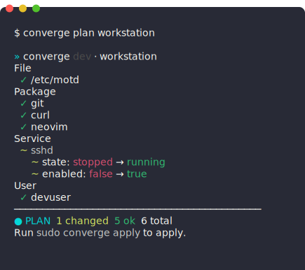

<div align="center">
  
  <h1>Converge</h1>
  <p><strong>Desired State Configuration, Compiled.</strong></p>

  [](https://codecov.io/gh/TsekNet/converge)
  [](LICENSE)
  [](https://github.com/TsekNet/converge/releases)
</div>

---

Compile all your linux/mac/windows configurations into a single binary. Inspired by tools like Chef, Puppet, Ansible, and Terraform.

<div align="center">



</div>

> **Disclaimer:** This was created as a fun side project (PoC), not affiliated with any company.

### Why Converge?

| Feature | Converge | Chef | Puppet | Ansible | Terraform |
|---------|----------|------|--------|---------|-----------|
| Language | Go | Ruby | Ruby DSL | YAML | HCL |
| Runtime deps | None | Ruby | JVM | Python | None |
| Config format | Go code | Ruby DSL | Ruby DSL | YAML | HCL |
| Type safety | Compile-time | Runtime | Runtime | Runtime | Runtime |
| Binary size | ~4 MB | Large install | Large install | Python + deps | ~80 MB |
| State file | No | No | No | No | Yes |
| IDE support | Full Go tooling | Limited | Limited | YAML only | Limited |

## Installation

```bash
go install github.com/TsekNet/converge/cmd/converge@latest
```

Or build from source:

```bash
git clone https://github.com/TsekNet/converge.git && cd converge
go build -o bin/converge ./cmd/converge
```

Cross-compile with [GoReleaser](https://goreleaser.com/): `goreleaser build --snapshot --clean`

## Quick Start

**1. Write a blueprint:**

```go
package workstation

import "github.com/TsekNet/converge/dsl"

func Blueprint(r *dsl.Run) {
    r.File("/etc/motd", dsl.FileOpts{Content: "Managed by Converge\n", Mode: 0644})
    r.Package("git", dsl.PackageOpts{State: dsl.Present})
    r.Service("sshd", dsl.ServiceOpts{State: dsl.Running, Enable: true})
    r.User("devuser", dsl.UserOpts{Groups: []string{"sudo"}, Shell: "/bin/bash"})
}
```

**2. Register in main.go:**

```go
package main

import (
    "github.com/TsekNet/converge/dsl"
    "github.com/myorg/myinfra/blueprints/workstation"
)

func main() {
    app := dsl.New()
    app.Register("workstation", "Developer workstation baseline", workstation.Blueprint)
    app.Execute()
}
```

**3. Plan and apply:**

```bash
converge plan workstation            # dry-run, no root needed
sudo converge apply workstation      # converge to desired state
```

**4. Output formats:**

```bash
converge plan workstation --out=terminal    # default: Unicode + color
converge plan workstation --out=serial      # ASCII-only (serial consoles, GCP)
converge plan workstation --out=json        # machine-readable
```

**5. Key flags:**

```bash
converge apply workstation --parallel 4        # run resources concurrently
converge apply workstation --timeout 2m        # per-resource timeout
converge plan workstation --detailed-exit-codes # granular exit codes for CI
```

## Documentation

| Doc | What it covers |
|-----|----------------|
| **[Design](docs/design.md)** | Philosophy, motivation, architecture, package layout, engine flow |
| **[Guide](docs/guide.md)** | How to write blueprints + built-in resource reference |
| **[CLI](docs/cli.md)** | Commands, flags, output formats, exit codes |
| **[Extending](docs/extending.md)** | How to add a new extension, platform-specific build tags |

Built-in blueprints: `converge list` shows available blueprints (`workstation`, `linux`, `darwin`, `windows`, `linux_server`).

## Contributing

See [CONTRIBUTING.md](CONTRIBUTING.md) for dev setup, code standards, and PR checklist.
