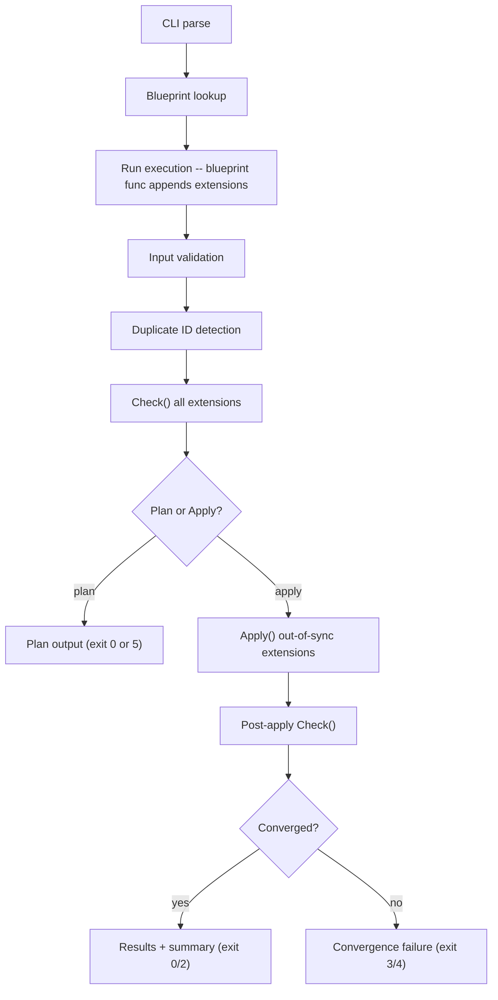

# Design

**[← Wiki Home](Home)** · [Guide](Guide) · [CLI](CLI) · [Extending](Extending)

Converge is a Go-based configuration management tool that compiles to a single static binary per platform. This document covers the motivation, design philosophy, and internal architecture.

---

## Problem Statement

We manage 500K+ endpoints across macOS, Windows, and Linux. Every mainstream configuration management tool drags an interpreted language runtime onto every endpoint, then asks you to write configuration logic in that runtime's DSL.

| Tool | Runtime Required | Language | State Model |
|-----------|-----------------|----------|-------------|
| Chef/Cinc | Ruby + gem deps | Ruby DSL | Converge-on-run (server or zero-agent) |
| Puppet | JVM + Ruby | Puppet DSL | Catalog compiled on server |
| Ansible | Python 2/3 | YAML + Jinja2 | Push-based, no local agent |
| Terraform | None (binary) | HCL | State file (remote or local) |
| Salt | Python | YAML + Jinja2 | Converge-on-run or push |

The problems compound at scale:

- **Runtime dependencies are a liability.** Chef needs Ruby. Ansible needs Python. Puppet needs a JVM. At 500K endpoints, every runtime is an attack surface, a version-skew headache, and a bootstrap chicken-and-egg problem.
- **Interpreted languages lack compile-time safety.** A typo in a Chef recipe, a wrong Jinja2 variable type in Ansible -- none fail until runtime, on a production endpoint, possibly at 2 AM.
- **YAML-based tools are stringly-typed.** Ansible playbooks and Salt states are YAML with string interpolation. No IDE autocompletion, no refactoring support, no type checking.
- **Terraform solves the wrong problem.** Excellent for provisioning infrastructure but wrong for endpoint configuration management. It requires state files and has no concept of converging local system state.
- **Cross-tool drift.** When Chef manages the same file in two cookbooks, the last recipe to run wins. No conflict detection.

---

## Solution

One `converge` binary per OS/arch. No Ruby, no Python, no JVM, no gem install, no pip, no apt. The binary IS the tool.

### Core Properties

| Property | Detail |
|----------|--------|
| Single binary, zero deps | Static binary per platform. Drop on a fresh image and run. |
| Blueprints are Go packages | Static types, compile-time errors, `go test`, IDE autocompletion. |
| Convergent, no state file | Every resource checks live system state on every run. No state file to corrupt. |
| Cross-platform from one codebase | Go build tags handle platform-specific implementations. |

---

## Design Philosophy

### Compiled > Interpreted

If it compiles, the resource definitions are structurally valid. The compiler catches misspelled resource names, wrong parameter types, missing required parameters, unused imports, and interface contract violations.

### Type-Safe > Stringly-Typed

Every resource parameter has a concrete Go type. `Mode` is `os.FileMode`, not a string. `Enabled` is `bool`, not `"true"`. The type system prevents an entire class of bugs that YAML-based tools silently accept.

### Simple > Clever

The target is 10-year maintainability:

- No custom DSL. It's Go.
- No inheritance hierarchies. Blueprints compose via function calls.
- No implicit behavior. If a resource does something, it's in the blueprint.
- No magic variables. Parameters are explicit function arguments.

### One Way to Do Things

One error handling pattern (the `Critical` flag). One way to include shared logic (`Include()`). One way to template files. Consistency at 500K endpoints matters more than flexibility.

---

## Security Model

| Mode | Privilege | Network | Mutations |
|---------|-----------------|---------|-----------|
| `plan` | Unprivileged | None | None (read-only `Check()` calls) |
| `apply` | root / SYSTEM | None | Applies changes where `Check()` reports drift |

- **No network by default.** Zero network calls during execution. All configuration is compiled in or read from local disk.
- **No secrets in code.** Secrets come from environment variables via `EnvRequired()`, which fails the run if the variable is unset.

---

## Convergent Model

The fundamental abstraction is the **resource**, implementing two methods:

```go
type Resource interface {
    Check(ctx Context) (State, error)
    Apply(ctx Context) error
}
```

| State | Meaning |
|-------------|----------------------------------------------|
| `OK` | System matches desired state. Nothing to do. |
| `Drifted` | System differs from desired state. |
| `Missing` | Resource doesn't exist yet. |
| `Error` | Can't determine state (permissions, etc.). |

`Check()` is read-only. `Apply()` mutates the system and is only called when `Check()` returns `Drifted` or `Missing`. A follow-up `Check()` must return `OK` -- otherwise Converge reports a convergence failure.

**Idempotency by construction:** Run it once, drift is fixed. Run it again, nothing changes. The engine enforces this via the Check/Apply split.

---

## Architecture

### Package Layout

```
converge/
├── dsl/                     # Public SDK (import "github.com/TsekNet/converge/dsl")
│   ├── converge.go          # State enums (Present, Absent, Running, Stopped)
│   ├── app.go               # App: New(), Register(), Execute(), RunPlan(), RunApply()
│   ├── blueprint.go         # Blueprint func type: func(*Run)
│   ├── opts.go              # FileOpts, PackageOpts, ServiceOpts, ExecOpts, UserOpts, RegistryOpts
│   ├── run.go               # Run: File(), Package(), Service(), Exec(), User(), Registry(), Include()
│   └── resources.go         # Wires DSL opts to real extension implementations
│
├── extensions/              # Public, community-extensible
│   ├── extension.go         # Extension interface: ID(), Check(), Apply(), String()
│   ├── state.go             # State, Change, Result types
│   ├── file/                # file.go, file_test.go
│   ├── exec/                # exec.go, exec_test.go
│   ├── pkg/                 # pkg.go (interface), apt.go, brew.go, choco.go
│   ├── service/             # service.go (interface), systemd.go, launchd.go, windows.go
│   ├── user/                # user.go (shared), user_linux.go, user_darwin.go, user_windows.go
│   └── registry/            # registry_stub.go (linux||darwin), registry_windows.go
│
├── internal/
│   ├── engine/              # Plan/apply orchestration, duplicate detection
│   ├── platform/            # OS, distro, init system, package manager detection
│   ├── output/              # CLI formatters (terminal, serial, json)
│   ├── logging/             # google/deck: syslog (Linux), eventlog (Windows), stderr
│   └── version/             # Version vars set by ldflags
│
├── cmd/converge/            # Cobra CLI: main.go, root.go, plan.go, apply.go, list.go, version.go
│
├── blueprints/              # All blueprints in a single package
│   ├── workstation.go
│   ├── linux.go
│   ├── darwin.go
│   ├── windows.go
│   └── linux_server.go
│
├── assets/                  # Logo, demo GIF, vhs-demo.go, demo.tape (see assets/README.md)
│
└── docs/
```

**Boundary rules:**

| Package | Importable by | Stability |
|---------|--------------|-----------|
| `dsl/` | Anyone (blueprint authors) | Public API, semver-guarded |
| `extensions/*` | Anyone (community contributors) | Public, add new extensions via PR |
| `internal/*` | Only this module | Free to change without notice |
| `cmd/converge/` | Nobody (main) | CLI contract only |

### Extension Interface

Every resource type implements:

```go
type Extension interface {
    ID() string
    Check(ctx context.Context) (*State, error)
    Apply(ctx context.Context) (*Result, error)
    String() string
}
```

- **ID()** -- unique identifier (e.g. `file:/etc/motd`, `package:git`). Used for duplicate detection.
- **Check()** -- reads current state, returns whether in sync. No root required.
- **Apply()** -- mutates the system. Requires root. Only called when Check() reports out-of-sync.
- **String()** -- human-readable label for output (e.g. `File /etc/motd`).

Platform-specific extensions split code using Go build tags:

```
extensions/user/
├── user.go            # Shared: struct, New(), ID(), String(), Check()
├── user_linux.go      # //go:build linux  -- Apply() using useradd/usermod
├── user_darwin.go     # //go:build darwin -- Apply() using dscl
└── user_windows.go    # //go:build windows  -- Apply() using net user
```

### Engine Flow



**Key behaviors:**

- **Declared order = execution order.** No dependency graph. Blueprint author controls ordering.
- **Duplicate detection.** Two extensions with same `ID()` = error before any Check().
- **Critical flag.** If `Critical: true` (default), failure aborts remaining apply.
- **Parallel execution.** `--parallel N` runs up to N resources concurrently (default: sequential).
- **Per-resource timeout.** `--timeout` sets the deadline for each resource's Check/Apply cycle.
- **Detailed exit codes.** `--detailed-exit-codes` enables granular exit codes (2=changed, 3=partial, 4=all failed, 5=pending) for CI/CD integration.

### Platform Abstraction

`internal/platform.Detect()` returns:

```go
type Info struct {
    OS         string // "linux", "darwin", "windows"
    Distro     string // "ubuntu", "fedora", "macos", "windows"
    PkgManager string // "apt", "dnf", "yum", "zypper", "apk", "pacman", "brew", "choco", "winget", ""
    InitSystem string // "systemd", "launchd", "windows", ""
    Arch       string // "amd64", "arm64"
}
```

### Output Architecture

All CLI output goes through a `Printer` interface with three implementations:

| Format | Notes |
|--------|-------|
| **terminal** | ANSI color, Unicode symbols, animated spinner, progress counter `[3/6]`. Default. |
| **serial** | ASCII-only, no escape codes, no spinner. For serial consoles, GCP, CI logs. |
| **json** | Full change details per resource. Machine-readable. |

### Demo GIF

`assets/vhs-demo.go` renders representative plan output for the README demo GIF. See [assets/README.md](https://github.com/TsekNet/converge/blob/main/assets/README.md) for prerequisites and setup. Regenerate:

```bash
vhs assets/demo.tape
```

### Logging

Uses [google/deck](https://github.com/google/deck) for structured logging:

- **Linux**: syslog (`journalctl -t converge`)
- **Windows**: Windows Event Log (Event Viewer > Application)
- **stderr**: only with `--verbose` flag

---

## Lessons from Chef

These are real bugs, outages, and hours lost managing endpoints with Chef at scale.

| Problem | Chef | Converge |
|---------|------|----------|
| Cross-cookbook file conflicts | Last recipe wins, no warning | Duplicate resource declarations are build errors |
| Type coercion | `"0"` is truthy in Ruby | `bool` is `bool`, compiler enforces types |
| Regex file mutations | `Chef::Util::FileEdit` with fragile regexes | Declarative file content, atomic writes |
| Inconsistent error handling | Some resources raise, some warn, some silently return | `Critical` flag: explicit per resource |
| Monolithic recipes | 573-line recipes, LWRP boilerplate discourages decomposition | `Include()` is a Go function call, zero boilerplate |
| No real unit testing | ChefSpec tests collections, not behavior; Test Kitchen takes 45 min | `go test` with mock Run, subsecond feedback |

---

## What Converge Is Not

- **Not a provisioning tool.** Use Terraform for VMs, networks, cloud resources.
- **Not a deployment tool.** No rolling deploys, canary releases, or blue-green.
- **Not a monitoring tool.** Plan mode detects drift, but Converge doesn't run as a daemon. Pair with Fleet/osquery/Prometheus.
- **Not a package repository.** It installs packages but doesn't host them.
